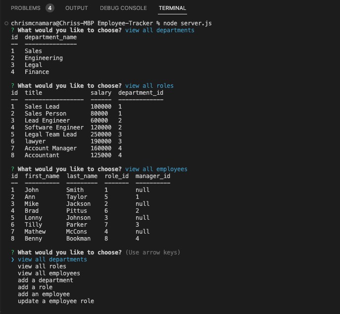
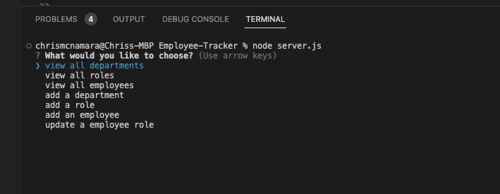

# Employee Tracker
#

## Table of Contents    
- [Description](#description)
- [Demo Video](#demo-video)
- [Repo URL](#repo-url)
- [Installation](#installation)
- [Usage Information](#usage-information)
- [Contribution Guidelines](#contribution-guidelines)
- [Test Instructions](#test-instructions)
- [License](#license)
- [Screenshots](#screenshots)
- [README Documentation](#readme-docmentation)

## Description
This project was built as an exercise in writing content management systems(CMS). Using Inquirer, I built a command-line application that that manages a mock company's employee database. This application allows the user to view the departments, roles and individual employee information using their command line. 

## Demo Video 
[Demo Video]() 

## REPO URL
[Repository URL](https://github.com/cmcnamara15/Employee_Tracker) 

## Installation
MYSQL, MYSQL2, Nodejs, Inquirer@8.2.4 

## Usage Information
The user should be familiar with the basic formatting of README files. 

## Contribution Guidelines 
Starter code was obtained from the UT Full Stack Coding Bootcamp. Open to collaboration and contribution. 

## Test Instructions
none

## License
MIT

## Questions 
If you have any questions please feel free to reach out. 

Github: [cmcnamara15](https://github.com/cmcnamara15) 
Email: cmcnamara1991@icloud.com

## Screenshots

The following screenshots shows the apps functionality. 

## Program running in terminal 

<!-- ## Example of database in terminal  -->

